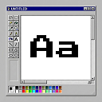

# Typography Generator

A Figma plugin for generating complete typography systems with text styles, variables, and design tokens.



## Features

- **Per-Category Configuration** - Configure Display, Title, Body, and Code typography independently
- **Multiple Scale Methods** - Modular, Linear, or Tailwind-style scales
- **Responsive Variants** - Generate Desktop and Mobile sizes with smart max caps
- **Flexible Output** - Create Text Styles, Variables, or both
- **Specimen Artboards** - Beautiful typography specimens for documentation
- **Design Token Export** - JSON, YAML, CSS Variables, and Tailwind config

## Installation

### From Figma Community
Search for "Typography Generator" in Figma's plugin browser.

### For Development
```bash
# Clone the repository
git clone https://github.com/cmonies/figma-typography-plugin.git
cd figma-typography-plugin

# Install dependencies
npm install

# Build the plugin
npm run build

# Watch for changes during development
npm run watch
```

Then in Figma: **Plugins → Development → Import plugin from manifest** and select the `manifest.json` file.

## Usage

1. **Categories Tab** - Configure each typography category:
   - Select font family and weights
   - Choose scale method (Modular/Linear/Tailwind)
   - Set min/max sizes and line-height preset

2. **Responsive Tab** - Enable mobile variants with:
   - Scale multiplier (default 87.5%)
   - Smart max caps per category

3. **Export Tab** - Choose outputs:
   - **Text Styles** - Traditional Figma text styles
   - **Variables** - Typography values in Variables panel
   - **Specimen** - Visual reference artboards
   - **Tokens** - JSON, YAML, CSS, Tailwind exports

4. Click **Generate Typography System**

## Output Formats

### Text Styles
Creates Figma text styles organized by category:
```
Display/D1/Bold
Title/H1/Semibold
Body/Base/Regular
Code/Base/Regular
```

### Variables
Creates a "Typography" variable collection with:
- `{category}/{size}/fontSize`
- `{category}/{size}/lineHeight`
- `{category}/{size}/letterSpacing`
- `{category}/{size}/fontWeight`
- `{category}/fontFamily`

### Design Tokens
Export typography as:
- **JSON** - W3C-style design tokens
- **YAML** - LLM-friendly format
- **CSS** - Custom properties
- **Tailwind** - Config snippet

## Default Scale Ranges

| Category | Min | Max | Use Case |
|----------|-----|-----|----------|
| Display | 40px | 72px | Hero text, splash screens |
| Title | 20px | 48px | H1-H6 headings |
| Body | 12px | 20px | Paragraphs, UI text |
| Code | 11px | 16px | Monospace, code blocks |

## Mobile Max Caps

Smart defaults prevent oversized mobile typography:
- Display: 48px max
- Title: 32px max
- Body: 20px max
- Code: 16px max

## Tech Stack

- **UI**: Preact + TypeScript
- **Build**: esbuild
- **API**: Figma Plugin API

## License

MIT

## Author

Built by [Carmen Monies](https://github.com/cmonies)
